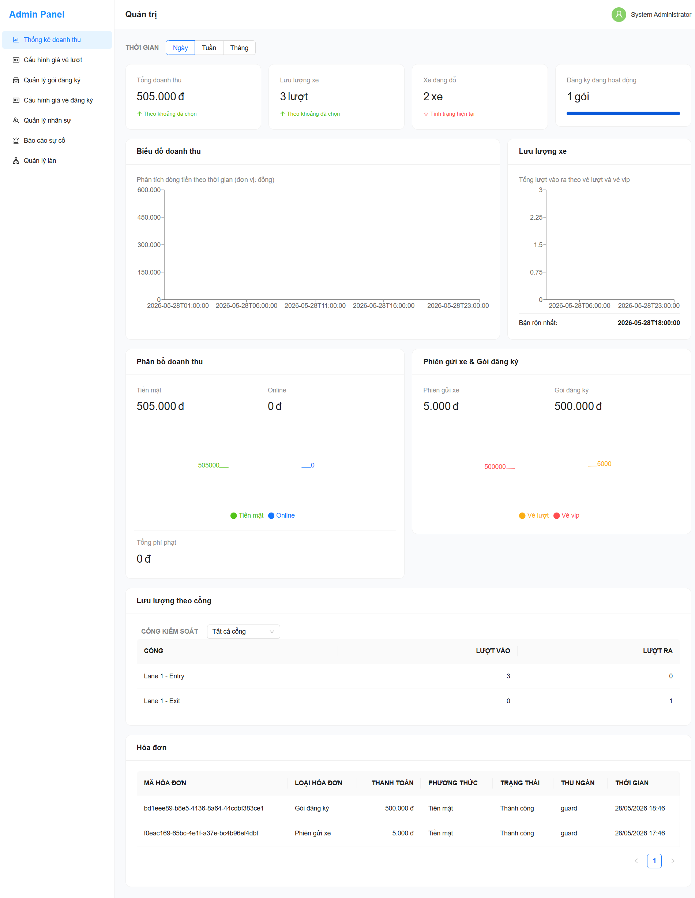
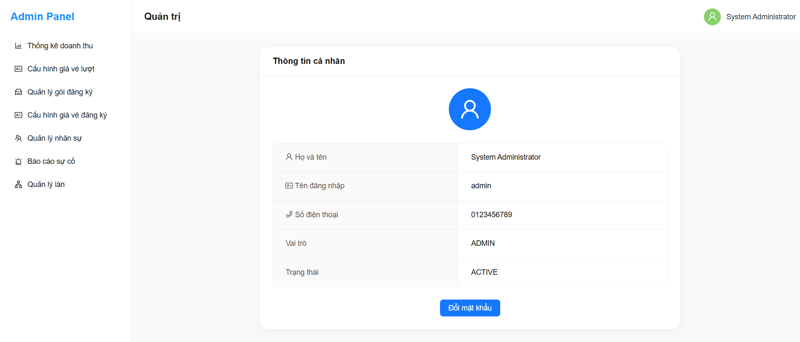
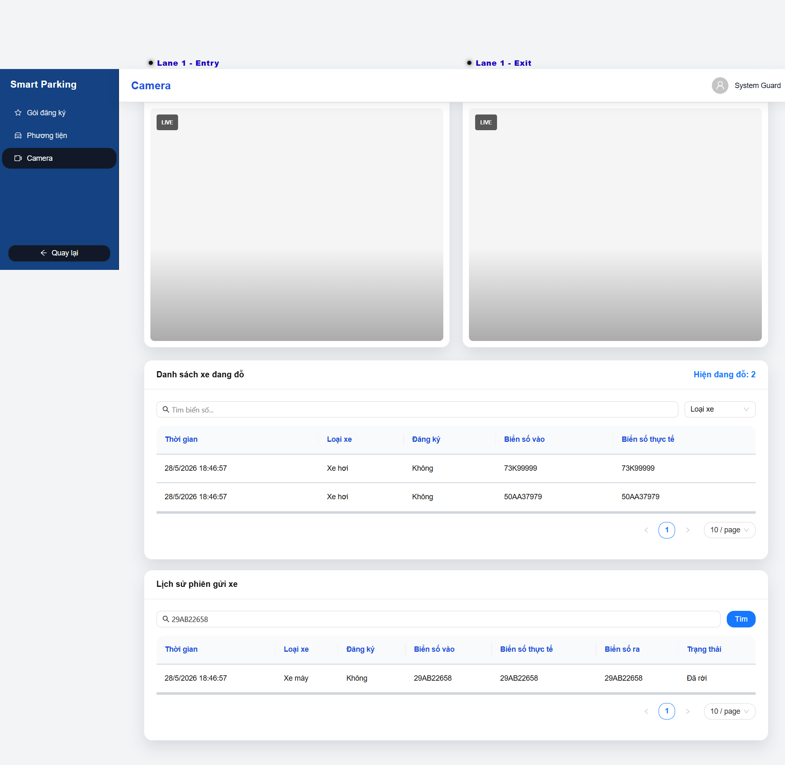
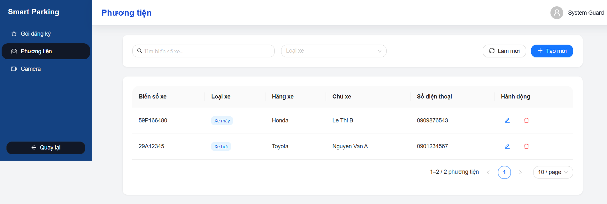
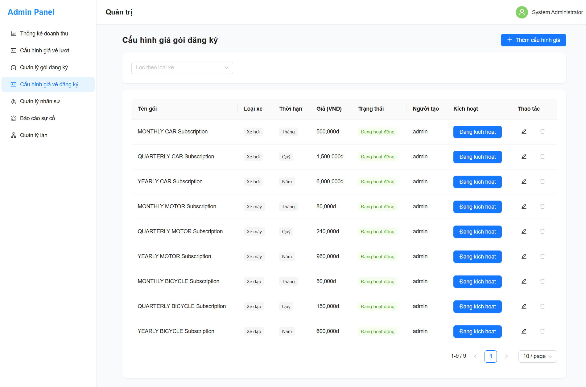
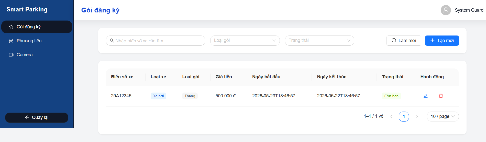
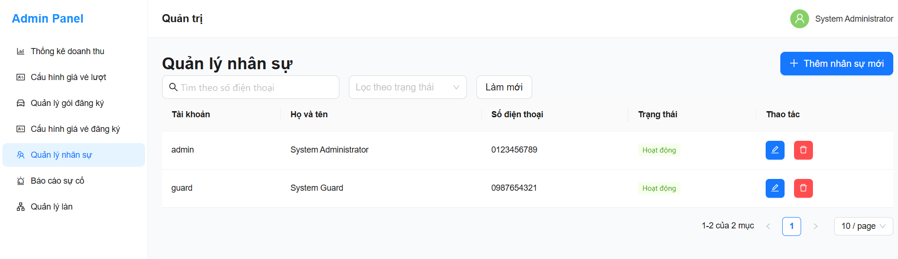
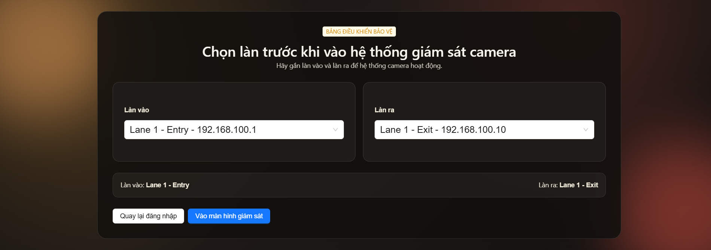

# Smart Parking System - Hệ thống Quản lý Bãi đỗ xe Thông minh

<div align="center">


**Giải pháp quản lý bãi đỗ xe toàn diện thế hệ mới với nhận diện biển số bằng AI (ANPR), giám sát làn xe Real-time, cấu hình phí linh hoạt và báo cáo trực quan**

[](https://openjdk.org)
[](https://spring.io/projects/spring-boot)
[](https://react.dev)
[](https://fastapi.tiangolo.com)
[](https://www.postgresql.org)

[Giới thiệu](#-giới-thiệu) • [Screenshots](#-screenshots) • [Tính năng](#-tính-năng-chính) • [Tech Stack](#-tech-stack) • [Kiến trúc](#-kiến-trúc-hệ-thống) • [Cài đặt](#-cài-đặt) • [Database](#-database-schema)

</div>

---

## 📖 Giới thiệu

**Smart Parking System** là hệ thống quản lý bãi đỗ xe thông minh toàn diện, tích hợp AI nhận diện biển số tự động thông qua camera giám sát và cập nhật trạng thái bãi đỗ theo thời gian thực. Được xây dựng dựa trên kiến trúc Multi-service / Monorepo hiện đại (Spring Boot + React + FastAPI + ONNX Runtime), hệ thống mang lại giải pháp quản lý tối ưu, bảo mật cao và khả năng mở rộng vượt trội cho các bãi đỗ xe thông minh quy mô lớn.

### ✨ Điểm nổi bật

- 🚗 **Check-in/Check-out tự động** bằng AI nhận diện biển số (ANPR) cực nhanh.
- 📊 **Dashboard thống kê** doanh thu, lưu lượng xe ra vào trực quan bằng biểu đồ Recharts.
- 🧭 **Theo dõi Real-time** trạng thái hoạt động của camera IP và luồng xe di chuyển.
- 💳 **Cấu hình phí linh hoạt** hỗ trợ đa dạng chiến lược tính giá (`FLAT_RATE`, `TIME_WINDOW`, `PROGRESSIVE`,... ).
- 🔐 **Phân quyền chặt chẽ (RBAC)** theo vai trò (Admin/Guard) bảo vệ bằng Spring Security + JWT.

---

## 📸 Screenshots

### 📊 Trang Đăng Nhập


---

### 🏠 Dashboard thống kê & Giám sát dành cho quản trị viên


---
### 🏠 Trang thông tin Nhân Viên & Thông tin cá nhân


---

### 🚗 Quản lý vào/ra dành cho nhân viên bảo vệ


---

### 📊 Quản lý phương tiện


---

### 💳 Cấu hình Chiến lược Giá Gói Đăng ký

| Cấu hình giá gói đăng ký | Quản lý gói đăng ký |
|------------------------------------|---------------------------|
|  |  |

---

### 👥 Quản lý Nhân viên & Quản Lý Lane

| Danh sách nhân sự & Phân quyền | Quản lý Lane |
|---------------------------------|---------------------------------------------|
|  |  |

---

## 🚀 Tính năng chính

### 🅿️ Quản lý Bãi đỗ & Sự kiện Real-time

| Tính năng | Mô tả |
|-----------|-------|
| 🚗 **Check-in/Check-out** | Nhận diện biển số thông qua camera, tự động ghi nhận thời gian vào/ra và so khớp thông tin |
| 🧭 **Giám sát làn xe** | Theo dõi trạng thái camera IP, hiển thị ảnh chụp đầu xe và biển số nhận diện tức thời |
| 💳 **Tính phí tự động** | Áp dụng biểu phí linh hoạt cho xe máy, ô tô, xe đạp theo cấu hình động cơ tính phí |
| 📝 **Lịch sử đỗ xe** | Lưu trữ toàn bộ lịch sử gửi xe kèm hình ảnh lúc vào/ra và độ tin cậy của thuật toán AI |
| ⚠️ **Xử lý sự cố** | Ghi nhận các sự cố (mất thẻ, hư hại tài sản, sai biển số) kèm bằng chứng hình ảnh |

### 🤖 Nhận diện & Xử lý AI

| Tính năng | Mô tả |
|-----------|-------|
| 🔍 **AI LPR Service** | Microservice FastAPI phục vụ nhận diện biển số xe máy và ô tô cực nhanh |
| ⚡ **ONNX Runtime** | Tối ưu hóa tốc độ suy luận của mô hình học sâu (Deep Learning) trên CPU |
| 🔠 **RapidOCR** | Trích xuất ký tự chữ và số từ biển số xe với độ chính xác cao (>95%) |
| 🖼️ **Xử lý hình ảnh** | Sử dụng OpenCV và Pillow để tối ưu hóa chất lượng ảnh đầu vào trước khi nhận diện |

### 🔐 Quản trị & Bảo mật

| Tính năng | Mô tả |
|-----------|-------|
| 👥 **Phân quyền RBAC** | Hỗ trợ 2 vai trò: `ADMIN` (Quản trị hệ thống) và `GUARD` (Nhân viên bảo vệ/Trực cổng) |
| 🔑 **Xác thực JWT** | Sử dụng Spring Security kết hợp mã băm mật khẩu BCrypt và Access Token |
| 🛠️ **Cấu hình biểu phí** | Thiết lập linh hoạt các gói giá: Flat Rate, Time Window, Rolling Block, Progressive, Daily Capped |
| 📅 **Cấu hình Vé tháng** | Thiết lập các gói đăng ký chu kỳ (Monthly, Quarterly, Yearly) và tạo vé tháng cho khách hàng |

### 📊 Thống kê & Báo cáo

| Tính năng | Mô tả |
|-----------|-------|
| 📈 **Dashboard trực quan** | Biểu đồ lưu lượng xe theo giờ, doanh thu theo ngày/tháng, và tỷ lệ lấp đầy bãi đỗ |


---

## 🛠 Tech Stack

### Backend

| Công nghệ | Version | Mô tả |
|-----------|---------|-------|
|  | 17 | Ngôn ngữ phát triển backend chính |
|  | 4.0.3 | Framework phát triển REST API & Service |
|  | 6.x | Hệ thống xác thực và bảo mật ứng dụng |
|  | - | Thư viện kết nối và quản trị database |
|  | - | Bộ nhớ đệm (Caching) hỗ trợ xử lý dữ liệu realtime |
|  | 2.8.6 | Hệ thống tự động sinh tài liệu API (Springdoc UI) |

### Frontend

| Công nghệ | Version | Mô tả |
|-----------|---------|-------|
|  | 19.2.4 | Thư viện xây dựng giao diện người dùng |
|  | 8.0.1 | Build tool thế hệ mới siêu nhanh |
|  | 6.3.5 | Thư viện component giao diện cao cấp |
|  | 2.12.7 | Thư viện biểu đồ thống kê trực quan |
|  | 1.16.1 | HTTP Client dùng để giao tiếp với REST API |

### AI LPR Service

| Công nghệ | Version | Mô tả |
|-----------|---------|-------|
|  | 3.10+ | Ngôn ngữ lập trình xử lý logic AI |
|  | - | Web framework nhẹ và cực nhanh cho AI API |
|  | - | Bộ chạy suy luận mô hình Deep Learning siêu nhẹ |
|  | 4.9.0 | Thư viện xử lý hình ảnh và khung hình |

### DevOps & Tools

| Công cụ | Mục đích |
|---------|----------|
|  | Containerization toàn bộ dịch vụ (App, DB, Redis, AI) |
|  | Quản lý phiên bản mã nguồn (Version Control) |
|  | Quản lý và đóng gói mã nguồn Backend |
|  | Bộ công cụ kiểm thử tự động E2E Frontend |

---

## 🏗 Kiến trúc hệ thống

```
┌─────────────────────────────────────────────────────────────┐
│                        CLIENT SIDE                          │
│  ┌─────────────────────────┐       ┌─────────────────────┐  │
│  │     Web Client (React)  │       │     IP Camera /     │  │
│  │    (Ant Design + Axios) │       │   Stream Emulator   │  │
│  └────────────┬────────────┘       └──────────┬──────────┘  │
└───────────────┼───────────────────────────────┼─────────────┘
                │ JWT / JSON                    │ Image Upload / REST
                ▼                               ▼
┌─────────────────────────────────────────────────────────────┐
│                     GATEWAY & SERVICES                      │
│  ┌───────────────────────────────────────────────────────┐  │
│  │               SPRING BOOT APPLICATION                 │  │
│  │  ┌─────────────────────────────────────────────────┐  │  │
│  │  │                  CONTROLLER (APIs)              │  │  │
│  │  │  Controllers & JWT Filter (API Endpoints)       │  │  │
│  │  └──────────────────────┬──────────────────────────┘  │  │
│  │                         ▼                             │  │
│  │  ┌─────────────────────────────────────────────────┐  │  │
│  │  │            SERVICES (Business Logic)            │  │  │
│  │  │  Services (Parking Logic, Pricing   , OCR Call) |  │  │
│  │  └──────────────────────┬──────────────────────────┘  │  │
│  │                         ▼                             │  │
│  │  ┌─────────────────────────────────────────────────┐  │  │──────────────────────────────┐
│  │  │      REPOSITORIES & ENTITIES (DATA ACCESS)      │  │  │                              │
│  │  │  Repositories (Spring Data JPA & File IO)       │  │  │                              │
│  │  └──────────────────────┬──────────────────────────┘  │  │                              │
│  └─────────────────────────┼─────────────────────────────┘  │                              │
└────────────────────────────┼────────────────────────────────┘                              │
                             │                                                               │
                             ▼                                                               │      
┌──────────────────────────────────────────────────────────────────────────────────┐         │
│                      DATA LAYER                                                  │         │
│  ┌─────────────────────────┐       ┌─────────────────────┐       ┌───────────┐   │         │
│  │       PostgreSQL        │       │     Redis Cache     │       |  Storage  │   │         │
│  │   (Database Schema)     │       │    (Session/Token)  │       |  (image)  │   │         │
│  └─────────────────────────┘       └─────────────────────┘       └───────────┘   │         │
└──────────────────────────────────────────────────────────────────────────────────┘         │
                                                                                             │
                                                                HTTP REST (Multipart Image)  │
                                                                                             │
┌─────────────────────────────────────────────────────────────┐                              │
│                 ARTIFICIAL INTELLIGENCE                     │                              │
│  ┌───────────────────────────────────────────────────────┐  │                              │
│  │              FASTAPI LPR AI SERVICE                   │  │                              │
│  │  ┌─────────────────────────────────────────────────┐  │  │──────────────────────────────┘
│  │  │             REST ENDPOINT (/ocr)                │  │  │
│  │  └──────────────────────┬──────────────────────────┘  │  │
│  │                         ▼                             │  │
│  │  ┌─────────────────────────────────────────────────┐  │  │
│  │  │           IMAGE PREPROCESSING (OpenCV)          │  │  │
│  │  └──────────────────────┬──────────────────────────┘  │  │
│  │                         ▼                             │  │
│  │  ┌─────────────────────────────────────────────────┐  │  │
│  │  │       ONNX RUNTIME (Plate Detection)            │  │  │
│  │  └──────────────────────┬──────────────────────────┘  │  │
│  │                         ▼                             │  │
│  │  ┌─────────────────────────────────────────────────┐  │  │
│  │  │     RAPIDOCR INFERENCE (Character Recognition)  │  │  │
│  │  └─────────────────────────────────────────────────┘  │  │
│  └───────────────────────────────────────────────────────┘  │
└─────────────────────────────────────────────────────────────┘
```

---

## 💻 Cài đặt

### Yêu cầu hệ thống

- Docker & Docker Compose (Khuyên dùng để cài đặt nhanh)
- Java JDK 17+ (Nếu chạy thủ công)
- Node.js 18+ & npm 9+ (Nếu chạy thủ công)
- Python 3.10+ (Nếu chạy thủ công)

### Cài đặt nhanh với Docker Compose

Đây là phương án nhanh nhất để khởi tạo toàn bộ các dịch vụ (PostgreSQL, Redis, AI Service, Spring Boot API):

```bash
# 1. Clone repository này về máy
git clone https://github.com/minh7709/smart-parking-system.git
cd smart-parking-system

# 2. Khởi chạy toàn bộ hệ thống ở môi trường dev
docker compose -f docker-compose.dev.yml up --build -d

# 3. Khởi tạo và chạy Frontend
cd frontend
npm install
npm run dev
```

*Sau khi chạy thành công, frontend sẽ hoạt động tại địa chỉ: `http://localhost:5173` và REST APIs hoạt động tại `http://localhost:8080`.*

### Cài đặt thủ công từng thành phần

Nếu muốn chạy từng dịch vụ riêng biệt để debug:

<details>
<summary>📂 Chi tiết cài đặt thủ công</summary>

#### 1. Cơ sở dữ liệu (PostgreSQL & Redis)
- Khởi động một instance PostgreSQL 15, tạo database tên `parking_db`.
- Import file SQL cấu trúc bảng tại: `database/webDb.sql` vào cơ sở dữ liệu.
- Khởi động một server Redis ở port mặc định `6379`.

#### 2. Dịch vụ AI (FastAPI OCR)
```bash
cd ai-service
# Tạo môi trường ảo Python
python -m venv .venv
# Kích hoạt môi trường ảo
# Trên Windows:
.venv\Scripts\activate
# Trên Linux/macOS:
source .venv/bin/activate

# Cài đặt thư viện
pip install -r requirements.txt

# Khởi chạy server FastAPI
uvicorn app.main:app --host 0.0.0.0 --port 8000 --reload
```

#### 3. Dịch vụ API Server (Spring Boot)
- Đảm bảo file `.env` hoặc các biến môi trường cấu hình đúng thông tin kết nối Database và URL của AI Service.
```bash
cd backend
# Build và chạy ứng dụng Spring Boot
./mvnw spring-boot:run
```

#### 4. Khởi động Giao diện Web (React)
```bash
cd frontend
npm install
npm run dev
```

</details>

### Tài khoản demo sinh tự động (Default Seeds)

Hệ thống tự động khởi tạo dữ liệu mẫu thông qua `DataInitializer` khi chạy ứng dụng lần đầu:

| Username | Password | Vai trò | Tên đầy đủ |
|----------|----------|---------|------------|
| `admin` | `123456Aa` | **ADMIN** | System Administrator |
| `guard` | `123456Aa` | **GUARD** | System Guard |

---

## 📊 Database Schema

<details>
<summary>📋 Các bảng dữ liệu chính (100% sử dụng UUID làm khóa chính)</summary>

| Bảng | Mô tả |
|------|-------|
| `users` | Lưu thông tin các tài khoản Admin, Guard phục vụ đăng nhập JWT |
| `vehicle` | Danh sách thông tin xe và thông tin khách hàng đăng ký vé tháng |
| `subscription_pricing` | Cấu hình biểu giá đăng ký vé tháng (Monthly, Quarterly, Yearly) |
| `subscription` | Thông tin đăng ký và hạn sử dụng của vé tháng của từng xe |
| `lane` | Cấu hình các làn xe vào/ra và địa chỉ IP camera tương ứng |
| `pricing_rule` | Cấu hình công thức tính giá tiền gửi xe theo lượt (FLAT_RATE, PROGRESSIVE,...) |
| `parking_session` | Lưu chi tiết từng lượt gửi xe (giờ vào/ra, ảnh chụp, biển số OCR, trạng thái) |
| `invoice` | Hóa đơn thanh toán tiền gửi xe theo lượt hoặc hóa đơn mua vé tháng |
| `incident` | Ghi nhận sự cố xảy ra trong bãi đỗ (Mất thẻ, va chạm hư hại, lỗi hệ thống...) |

</details>

---

## 🧪 Testing

Hệ thống hỗ trợ đầy đủ các bộ kiểm thử cho các tầng:

### Kiểm thử Backend (Spring Boot Unit & Integration Tests)
```bash
cd backend
# Chạy toàn bộ các unit tests
./mvnw test
```

### Kiểm thử Frontend (Jest & Playwright E2E)
```bash
cd frontend
# Chạy unit tests cho các component React
npm test

# Chạy e2e browser tests thông qua Playwright
npm run test:e2e
```

---

[](https://github.com/minh7709/smart-parking-system)

[⬆ Về đầu trang](#smart-parking-system---hệ-thống-quản-lý-bãi-đỗ-xe-thông-minh)
